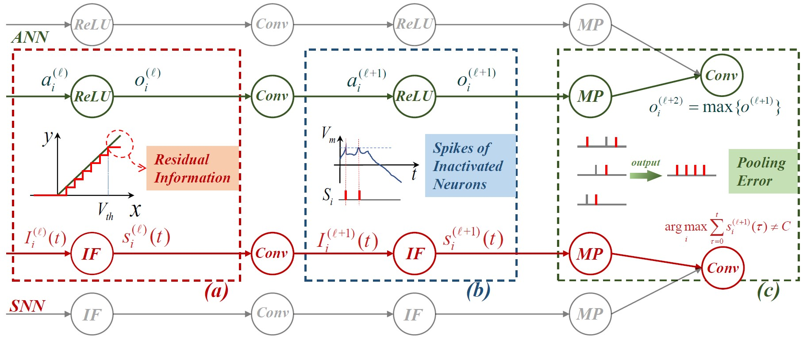

# Efficient and Accurate Conversion of Spiking Neural Network with Burst Spikes
This repository contains code from our paper titled "Efficient and Accurate Conversion of Spiking Neural Network with Burst Spikes" published in IJCAI, 2022.




## Files

- `CIFAR100_VGG16.py`: train an ANN
- `converted_CIFAR100_vgg.py`: converted the trained ANN. Including getting the max activation values, fusing the `Conv` and `BN` layers, doing weight normalization.
- `utils.py`: some tricks for data augmentation.


## Requirements

- numpy
- tqdm
- copy
- pytorch >= 1.10.0
- torchvision


## Run

Firstly, train an ANN

```bash
python CIFAR100_VGG16.py
```

Then, modify the model path in `converted_CIFAR100_vgg.py` and run 

```bash
python converted_CIFAR100_vgg.py
```


## Citation

If you use this code in your work, please cite the following paper, please cite it using

```
@misc{li2022efficient,
      title={Efficient and Accurate Conversion of Spiking Neural Network with Burst Spikes}, 
      author={Yang Li and Yi Zeng},
      year={2022},
      eprint={2204.13271},
      archivePrefix={arXiv},
      primaryClass={cs.NE}
}
```


